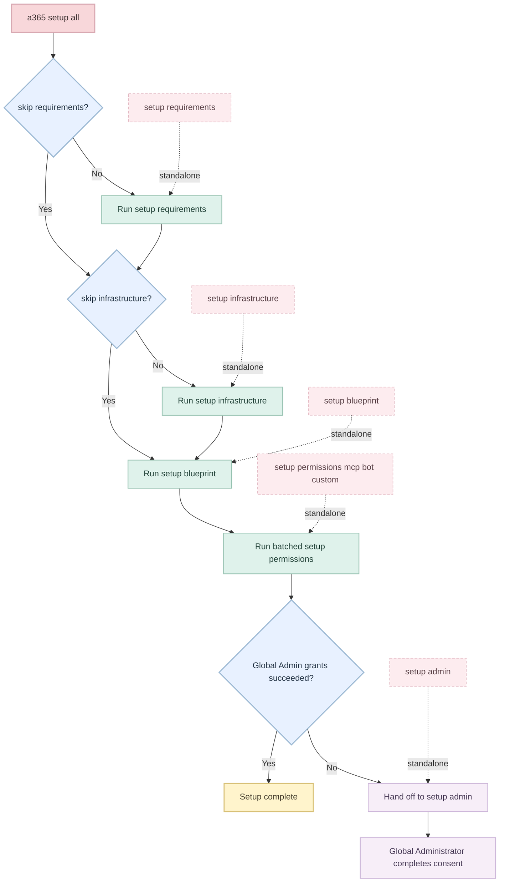

# `a365 setup` Execution Flow Research

This document is organized around the way the CLI actually processes `a365 setup all`.
Instead of grouping only by technology, it follows the subcommand execution flow the code uses:

1. `setup requirements`
2. `setup infrastructure`
3. `setup blueprint`
4. `setup permissions` (batched inside `setup all`)
5. `setup admin` when Global Administrator action is still required

Primary source files:

- `Commands/SetupCommand.cs`
- `Commands/SetupSubcommands/AllSubcommand.cs`
- `Commands/SetupSubcommands/RequirementsSubcommand.cs`
- `Commands/SetupSubcommands/InfrastructureSubcommand.cs`
- `Commands/SetupSubcommands/BlueprintSubcommand.cs`
- `Commands/SetupSubcommands/PermissionsSubcommand.cs`
- `Commands/SetupSubcommands/BatchPermissionsOrchestrator.cs`

---

## Table of Contents

1. [Execution Order](#1-execution-order)
2. [Subcommand 1: `a365 setup requirements`](#2-subcommand-1-a365-setup-requirements)
3. [Subcommand 2: `a365 setup infrastructure`](#3-subcommand-2-a365-setup-infrastructure)
4. [Subcommand 3: `a365 setup blueprint`](#4-subcommand-3-a365-setup-blueprint)
5. [Subcommand 4: `a365 setup permissions` inside `setup all`](#5-subcommand-4-a365-setup-permissions-inside-setup-all)
6. [Standalone Command Mapping](#6-standalone-command-mapping)
7. [Execution Summary by Backend](#7-execution-summary-by-backend)
8. [Official Documentation and API References](#8-official-documentation-and-api-references)

---

## 1. Execution Order

`a365 setup all` is not a shell script that literally invokes each CLI subcommand as a child process.
It is an in-process orchestrator implemented in `AllSubcommand.CreateCommand(...)` that directly calls the same implementation methods used by the standalone subcommands.

### Effective flow inside `a365 setup all`

| Order | Logical subcommand | Actual implementation entry point | Notes |
|------|---------------------|-----------------------------------|-------|
| 0 | `a365 setup requirements` | `RequirementsSubcommand.RunChecksOrExitAsync(...)` | Skipped with `--skip-requirements` |
| 1 | `a365 setup infrastructure` | `InfrastructureSubcommand.CreateInfrastructureImplementationAsync(...)` | Skipped with `--skip-infrastructure` or when `NeedDeployment=false` |
| 2 | `a365 setup blueprint` | `BlueprintSubcommand.CreateBlueprintImplementationAsync(...)` | Called with `skipEndpointRegistration: true` and deferred consent |
| 3 | `a365 setup permissions ...` | `BatchPermissionsOrchestrator.ConfigureAllPermissionsAsync(...)` | Consolidates Graph, MCP, Bot, Power Platform, and custom permissions |
| 4 | `a365 setup admin` | Not executed automatically | Recommended only if admin consent is still pending |

### Dry-run behavior

| Command | Behavior |
|---------|----------|
| `a365 setup all --dry-run` | Prints the planned sequence only; no Azure, PowerShell, Graph, or file mutations |
| `a365 setup infrastructure --dry-run` | Prints the Azure resources that would be created |
| `a365 setup blueprint --dry-run` | Prints the blueprint operations that would be executed |
| `a365 setup permissions mcp --dry-run` | Prints MCP scopes and planned grants |
| `a365 setup permissions bot --dry-run` | Prints Bot/Observability/Power Platform scopes |

---

## 2. Subcommand 1: `a365 setup requirements`

Source path:

- `Commands/SetupSubcommands/RequirementsSubcommand.cs`
- `Services/Requirements/RequirementChecks/*.cs`

This phase validates that later subcommands can run successfully. Some checks are read-only, but some can mutate tenant state or local machine state.

### 2.1 Check order

| Check | Implementation | Effect |
|------|----------------|--------|
| Azure Authentication | `AzureAuthRequirementCheck` | Verifies Azure CLI login and subscription |
| Frontier Preview | `FrontierPreviewRequirementCheck` | Validates config / feature readiness |
| PowerShell Modules | `PowerShellModulesRequirementCheck` | Verifies or installs required PowerShell modules |
| Location | `LocationRequirementCheck` | Verifies config field |
| Client App | `ClientAppRequirementCheck` | Verifies client app registration, permissions, and consent |
| Infrastructure | `InfrastructureRequirementCheck` | Verifies infra config fields when deployment is required |

### 2.2 Actual commands and API calls

| Triggered from `a365 setup requirements` | Backend | Purpose |
|------------------------------------------|---------|---------|
| `az account show --output json` | Azure CLI | Read active login and subscription |
| `az account set --subscription {subscriptionId}` | Azure CLI | Switch active subscription if needed |
| `pwsh -NoProfile -Command "Get-Module -ListAvailable -Name Microsoft.Graph.Authentication"` | PowerShell | Check Graph PowerShell module presence |
| `pwsh -NoProfile -Command "Install-Module Microsoft.Graph.Authentication -Scope CurrentUser -Force"` | PowerShell | Install missing module |
| `GET /v1.0/applications?$filter=appId eq '{clientAppId}'&$select=id,publicClient` | Graph API | Verify client app exists |
| `GET /v1.0/applications?$filter=appId eq '{clientAppId}'&$select=id,isFallbackPublicClient` | Graph API | Check device-code/public-client settings |
| `PATCH /v1.0/applications/{objectId}` | Graph API | Auto-fix `isFallbackPublicClient=true` |
| `GET /v1.0/servicePrincipals?$filter=appId eq '{clientAppId}'&$select=id` | Graph API | Get client app service principal |
| `GET /v1.0/oauth2PermissionGrants?$filter=clientId eq '{spObjectId}'` | Graph API | Inspect existing delegated grants |
| `GET /v1.0/servicePrincipals?$filter=appId eq '00000003-0000-0000-c000-000000000000'&$select=id` | Graph API | Resolve Microsoft Graph service principal |
| `PATCH /v1.0/oauth2PermissionGrants/{grantId}` | Graph API | Best-effort extension of existing grant |
| Local config validation | Local | Validate `tenantId`, `location`, `resourceGroup`, and similar fields |

### 2.3 Important behavior

- `setup all` runs this phase once up front unless `--skip-requirements` is used.
- `ClientAppRequirementCheck` is not purely diagnostic. It can update the app registration and extend existing consent grants.
- `PowerShellModulesRequirementCheck` can install modules, so it is also mutating.

---

## 3. Subcommand 2: `a365 setup infrastructure`

Source path:

- `Commands/SetupSubcommands/InfrastructureSubcommand.cs`
- `Services/ArmApiService.cs`

This phase provisions or reuses Azure hosting resources and persists managed identity state into `a365.generated.config.json`.

### 3.1 Logical flow

| Step | Operation |
|------|-----------|
| 1 | Validate Azure authentication |
| 2 | Check or create resource group |
| 3 | Check or create App Service plan |
| 4 | Check or create Web App |
| 5 | Enable system-assigned managed identity |
| 6 | Verify managed identity appears in Entra ID |
| 7 | Ensure current user has sufficient website access |
| 8 | Persist managed identity values to generated config |

### 3.2 Actual commands and API calls

| Triggered from `a365 setup infrastructure` | Backend | Purpose |
|--------------------------------------------|---------|---------|
| `az login --tenant {tenantId}` | Azure CLI | Authenticate if Azure CLI is not signed in |
| `GET https://management.azure.com/subscriptions/{sub}/resourcegroups/{rg}?api-version=2021-04-01` | ARM REST | Fast resource group existence check |
| `az group exists -n {resourceGroup} --subscription {subscriptionId}` | Azure CLI | Fallback RG existence check |
| `az group create -n {resourceGroup} -l {location} --subscription {subscriptionId}` | Azure CLI | Create resource group |
| `GET https://management.azure.com/subscriptions/{sub}/resourceGroups/{rg}/providers/Microsoft.Web/serverfarms/{plan}?api-version=2022-03-01` | ARM REST | Fast App Service plan existence check |
| `az appservice plan show -g {rg} -n {plan} --subscription {sub}` | Azure CLI | Fallback plan existence check |
| `az appservice plan create -g {rg} -n {plan} --sku {sku} --location {loc} --is-linux --subscription {sub}` | Azure CLI | Create App Service plan |
| `az appservice plan show -g {rg} -n {plan} --subscription {sub}` | Azure CLI | Verify plan creation with retries |
| `GET https://management.azure.com/subscriptions/{sub}/resourceGroups/{rg}/providers/Microsoft.Web/sites/{app}?api-version=2022-03-01` | ARM REST | Fast Web App existence check |
| `az webapp show -g {rg} -n {app} --subscription {sub}` | Azure CLI | Fallback Web App existence check |
| `az webapp create -g {rg} -p {plan} -n {app} --runtime "{runtime}" --subscription {sub}` | Azure CLI | Create Web App |
| `az webapp show -g {rg} -n {app} --subscription {sub}` | Azure CLI | Verify Web App creation with retries |
| `az webapp config set -g {rg} -n {app} --linux-fx-version "{runtime}" --subscription {sub}` | Azure CLI | Update runtime if app already exists |
| `az webapp identity assign -g {rg} -n {app} --subscription {sub}` | Azure CLI | Enable system-assigned MSI |
| `GET /v1.0/servicePrincipals/{principalId}?$select=id` | Graph API | Verify MSI service principal propagation |
| `az ad sp show --id {principalId}` | Azure CLI | Fallback MSI propagation check |
| `GET /v1.0/me?$select=id` | Graph API | Resolve current signed-in user |
| `az ad signed-in-user show --query id -o tsv` | Azure CLI | Fallback current-user lookup |
| `GET https://management.azure.com/subscriptions/{sub}/providers/Microsoft.Authorization/roleAssignments?api-version=2022-04-01&$filter=assignedTo('{userId}')` | ARM REST | Check effective RBAC at or above Web App scope |
| `az role assignment list --assignee {userId} --scope {webAppScope} --include-inherited ... -o tsv` | Azure CLI | Fallback RBAC check |
| `az role assignment create --role "Website Contributor" --assignee-object-id {userId} --scope {webAppScope} --assignee-principal-type User` | Azure CLI | Assign Website Contributor if needed |
| Write `managedIdentityPrincipalId` and related fields | Local file | Update `a365.generated.config.json` |

### 3.3 Runtime selection

`PlatformDetector.Detect()` decides the Web App runtime from the project path:

| Project type | Typical runtime string |
|-------------|------------------------|
| .NET | `DOTNETCORE|8.0` |
| Node.js | `NODE|20-lts` |
| Python | `PYTHON|3.12` |

### 3.4 Skip behavior

- `a365 setup all --skip-infrastructure` bypasses this entire phase.
- If `NeedDeployment=false`, the phase also becomes effectively a blueprint-only path.

---

## 4. Subcommand 3: `a365 setup blueprint`

Source path:

- `Commands/SetupSubcommands/BlueprintSubcommand.cs`
- `Services/DelegatedConsentService.cs`
- `Services/BlueprintLookupService.cs`
- `Services/AgentBlueprintService.cs`
- `Services/FederatedCredentialService.cs`

This phase creates or reuses the agent blueprint app registration, ensures delegated prerequisites, configures FIC, and creates the client secret.

### 4.1 Logical flow

| Step | Operation |
|------|-----------|
| 1 | Ensure delegated blueprint permission on the custom client app |
| 2 | Search for an existing blueprint by display name |
| 3 | Create the blueprint app if not found |
| 4 | Create or recover the blueprint service principal |
| 5 | Configure federated identity credential |
| 6 | Create or validate client secret |
| 7 | Persist blueprint metadata to generated config |

### 4.2 Delegated consent prerequisite

| Triggered from `a365 setup blueprint` | Backend | Purpose |
|---------------------------------------|---------|---------|
| MSAL token acquisition with delegated Graph scopes | MSAL | Authenticate Graph calls for consent management |
| `GET /v1.0/servicePrincipals?$filter=appId eq '{clientAppId}'` | Graph API | Resolve client app service principal |
| `POST /v1.0/servicePrincipals` with `{ appId }` | Graph API | Create client app SP if missing |
| `GET /v1.0/servicePrincipals?$filter=appId eq '00000003-0000-0000-c000-000000000000'` | Graph API | Resolve Microsoft Graph SP |
| `GET /v1.0/oauth2PermissionGrants?$filter=clientId eq '{clientSpId}' and resourceId eq '{graphSpId}' and consentType eq 'AllPrincipals'` | Graph API | Read existing grant |
| `POST /v1.0/oauth2PermissionGrants` | Graph API | Create grant if missing |
| `PATCH /v1.0/oauth2PermissionGrants/{grantId}` | Graph API | Merge required scope onto existing grant |

### 4.3 Idempotency lookup

| Triggered from `a365 setup blueprint` | Backend | Purpose |
|---------------------------------------|---------|---------|
| `GET /beta/applications?$filter=displayName eq '{displayName}'` | Graph API beta | Find an existing blueprint by name |
| `GET /v1.0/servicePrincipals?$filter=appId eq '{appId}'&$select=id` | Graph API | Resolve or verify the blueprint SP |

### 4.4 New blueprint creation path

| Triggered from `a365 setup blueprint` | Backend | Purpose |
|---------------------------------------|---------|---------|
| MSAL interactive auth with `Application.ReadWrite.All` | MSAL | Acquire token for blueprint creation |
| `GET /v1.0/me` | Graph API | Resolve current user for sponsors and owners |
| `POST /beta/applications` | Graph API beta | Create the blueprint app registration |
| `GET /v1.0/applications/{objectId}` | Graph API | Verify app replication |
| `PATCH /v1.0/applications/{objectId}` with `identifierUris` | Graph API | Set `api://{appId}` identifier URI |
| `POST /v1.0/servicePrincipals` with `{ appId }` | Graph API | Create blueprint service principal |
| `GET /v1.0/oauth2PermissionGrants?$filter=clientId eq '{servicePrincipalId}'` | Graph API | Probe service-principal visibility for later grants |

### 4.5 Federated identity credential

| Triggered from `a365 setup blueprint` | Backend | Purpose |
|---------------------------------------|---------|---------|
| `GET /beta/applications/{objectId}/federatedIdentityCredentials` | Graph API beta | Read existing FICs |
| `GET /beta/applications/microsoft.graph.agentIdentityBlueprint/{objectId}/federatedIdentityCredentials` | Graph API beta | Fallback read path |
| `POST /beta/applications/{objectId}/federatedIdentityCredentials` | Graph API beta | Create FIC |
| `POST /beta/applications/microsoft.graph.agentIdentityBlueprint/{objectId}/federatedIdentityCredentials` | Graph API beta | Fallback create path |

The FIC payload maps the Web App managed identity to the blueprint for token exchange.

### 4.6 Client secret creation and validation

| Triggered from `a365 setup blueprint` | Backend | Purpose |
|---------------------------------------|---------|---------|
| MSAL token acquisition with `AgentIdentityBlueprint.ReadWrite.All` | MSAL | Acquire token for `addPassword` |
| `POST /v1.0/applications/{objectId}/addPassword` | Graph API | Create client secret |
| `POST https://login.microsoftonline.com/{tenantId}/oauth2/v2.0/token` | OAuth token endpoint | Validate an existing client secret via client credentials |
| Write `agentBlueprintClientSecret` and protection flags | Local file | Persist secret into `a365.generated.config.json` |

### 4.7 `setup all` differences from standalone `setup blueprint`

Inside `a365 setup all`, this implementation is called with:

- `skipEndpointRegistration: true`
- `BlueprintCreationOptions(DeferConsent: true)`

That means:

- endpoint registration is intentionally not performed here
- Graph and resource consent work is deferred to the later batch permissions phase

---

## 5. Subcommand 4: `a365 setup permissions` inside `setup all`

Source path:

- `Commands/SetupSubcommands/PermissionsSubcommand.cs`
- `Commands/SetupSubcommands/BatchPermissionsOrchestrator.cs`
- `Services/AgentBlueprintService.cs`
- `Services/GraphApiService.cs`

When the user runs standalone commands, permissions are split across:

- `a365 setup permissions mcp`
- `a365 setup permissions bot`
- `a365 setup permissions custom`
- `a365 setup admin`

When the user runs `a365 setup all`, the CLI does not spawn those commands. It builds one combined spec list and runs a single batch orchestrator.

### 5.1 Resources included in the batch

| Resource | Typical scopes |
|----------|----------------|
| Microsoft Graph | `agentApplicationScopes` from config |
| Agent 365 Tools (MCP) | Scopes read from `ToolingManifest.json` |
| Messaging Bot API | `Authorization.ReadWrite`, `user_impersonation` |
| Observability API | `user_impersonation` |
| Power Platform API | `Connectivity.Connections.Read` |
| Custom resources | `customBlueprintPermissions` from config |

### 5.2 Pre-step: stale custom permission cleanup

| Triggered from batched permissions | Backend | Purpose |
|-----------------------------------|---------|---------|
| `GET /beta/applications/microsoft.graph.agentIdentityBlueprint/{objectId}/inheritablePermissions` | Graph API beta | Enumerate current inheritable permissions |
| `DELETE /beta/applications/microsoft.graph.agentIdentityBlueprint/{objectId}/inheritablePermissions/{resourceAppId}` | Graph API beta | Remove stale custom entries |

### 5.3 Phase 1: resolve service principals

| Triggered from batched permissions | Backend | Purpose |
|-----------------------------------|---------|---------|
| `GET /v1.0/me?$select=id` | Graph API | Pre-warm delegated token |
| `GET /v1.0/servicePrincipals?$filter=appId eq '{blueprintAppId}'&$select=id` | Graph API | Resolve blueprint service principal |
| `GET /v1.0/servicePrincipals?$filter=appId eq '{resourceAppId}'&$select=id` | Graph API | Resolve each resource service principal |
| `POST /v1.0/servicePrincipals` with `{ appId }` | Graph API | Create missing resource service principal |

### 5.4 Phase 2a: inheritable permissions

| Triggered from batched permissions | Backend | Purpose |
|-----------------------------------|---------|---------|
| `GET /beta/applications/microsoft.graph.agentIdentityBlueprint/{objectId}/inheritablePermissions` | Graph API beta | Read current inheritable permission state |
| `POST /beta/applications/microsoft.graph.agentIdentityBlueprint/{objectId}/inheritablePermissions` | Graph API beta | Create new inheritable permission entry |
| `PATCH /beta/applications/microsoft.graph.agentIdentityBlueprint/{objectId}/inheritablePermissions/{resourceAppId}` | Graph API beta | Merge new scopes into existing entry |
| `GET /beta/applications/microsoft.graph.agentIdentityBlueprint/{objectId}/inheritablePermissions` | Graph API beta | Verify scopes were persisted |

This runs once per resource spec.

### 5.5 Phase 2b: admin role check and OAuth2 grants

| Triggered from batched permissions | Backend | Purpose |
|-----------------------------------|---------|---------|
| `GET /v1.0/me/transitiveMemberOf/microsoft.graph.directoryRole?$select=roleTemplateId` | Graph API | Check whether current user is Global Administrator |
| `GET /v1.0/oauth2PermissionGrants?$filter=clientId eq '{blueprintSpId}' and resourceId eq '{resourceSpId}'` | Graph API | Read existing grant for a resource |
| `POST /v1.0/oauth2PermissionGrants` | Graph API | Create tenant-wide `AllPrincipals` grant |
| `PATCH /v1.0/oauth2PermissionGrants/{grantId}` | Graph API | Merge scopes into an existing grant |

Important behavior:

- inheritable permissions can succeed for Agent ID Administrator or Global Administrator
- OAuth2 grants require Global Administrator
- non-admin users still complete most of the flow, but consent remains pending

### 5.6 Phase 3: admin consent handoff

| Triggered from batched permissions | Backend | Purpose |
|-----------------------------------|---------|---------|
| Build combined admin consent URL | Local | Generate a handoff URL for a Global Administrator |
| Write consent URLs and `resourceConsents` | Local file | Persist pending consent state into `a365.generated.config.json` |

This phase does not call Graph directly when the user is non-admin. It prepares the follow-up path instead.

---

## 6. Standalone Command Mapping

This is the command-level view a user sees, aligned to the internal execution model.

| User command | Internal behavior |
|--------------|-------------------|
| `a365 setup all` | Runs requirements, infrastructure, blueprint, and one batched permissions workflow |
| `a365 setup all --skip-requirements` | Starts directly at infrastructure |
| `a365 setup all --skip-infrastructure` | Skips Azure hosting creation and continues with blueprint plus permissions |
| `a365 setup requirements` | Runs requirement checks only |
| `a365 setup infrastructure` | Runs Azure hosting creation only |
| `a365 setup blueprint` | Runs delegated consent, blueprint creation/reuse, FIC, and client secret creation |
| `a365 setup permissions mcp` | Standalone MCP permission configuration |
| `a365 setup permissions bot` | Standalone Bot, Observability, and Power Platform permission configuration |
| `a365 setup permissions custom` | Standalone custom resource permission configuration |
| `a365 setup admin` | Final Global Administrator follow-up for pending consent |

### 6.1 `a365 setup permissions mcp`

| Standalone command | Triggered actions |
|--------------------|------------------|
| `a365 setup permissions mcp` | Read `ToolingManifest.json`, resolve MCP resource SP, set inheritable permissions, create or update OAuth2 grant |

### 6.2 `a365 setup permissions bot`

| Standalone command | Triggered actions |
|--------------------|------------------|
| `a365 setup permissions bot` | Resolve Messaging Bot API, Observability API, and Power Platform API SPs; set inheritable permissions; create or update OAuth2 grants |

### 6.3 `a365 setup permissions custom`

| Standalone command | Triggered actions |
|--------------------|------------------|
| `a365 setup permissions custom` | For each configured custom resource, resolve SP, set inheritable permissions, create or update OAuth2 grant, and remove stale custom entries |

### 6.4 `a365 setup admin`

| Standalone command | Triggered actions |
|--------------------|------------------|
| `a365 setup admin` | Re-check admin role, retry tenant-wide OAuth2 grants, and complete final consent-related follow-up |

---

## 7. Execution Summary by Backend

### 7.1 By backend type

| Backend | Approximate usage during `setup all` | Typical responsibilities |
|---------|-------------------------------------|--------------------------|
| Azure CLI | 10-15 calls | Azure login, resource creation, Web App identity, RBAC assignment, CLI fallbacks |
| ARM REST API | 4-5 calls | Fast existence checks and role assignment discovery |
| Microsoft Graph API | 40-60+ calls | App registrations, service principals, inheritable permissions, OAuth2 grants, role checks, FICs |
| MSAL | 3-5 token acquisitions | ARM token, delegated Graph token, app-management Graph token, blueprint update token |
| OAuth token endpoint | 1-2 calls | Existing client secret validation |

### 7.2 Major Graph endpoints used

| Endpoint family | Methods |
|-----------------|---------|
| `/v1.0/me` | GET |
| `/v1.0/me/transitiveMemberOf/microsoft.graph.directoryRole` | GET |
| `/v1.0/applications` and `/beta/applications` | GET, POST, PATCH |
| `/v1.0/applications/{id}/addPassword` | POST |
| `/v1.0/servicePrincipals` and `/beta/servicePrincipals` | GET, POST, DELETE |
| `/v1.0/oauth2PermissionGrants` | GET, POST, PATCH |
| `/beta/applications/{id}/federatedIdentityCredentials` | GET, POST, DELETE |
| `/beta/applications/microsoft.graph.agentIdentityBlueprint/{id}/inheritablePermissions` | GET, POST, PATCH, DELETE |

### 7.3 Azure CLI commands observed

| Azure CLI command | Usage |
|-------------------|-------|
| `az login --tenant {tenantId}` | Authenticate Azure CLI |
| `az account show --output json` | Read current account context |
| `az account set --subscription {subscriptionId}` | Switch subscription |
| `az group exists ...` / `az group create ...` | Resource group lifecycle |
| `az appservice plan show ...` / `az appservice plan create ...` | App Service plan lifecycle |
| `az webapp show ...` / `az webapp create ...` / `az webapp config set ...` | Web App lifecycle and runtime config |
| `az webapp identity assign ...` | System-assigned managed identity |
| `az ad sp show --id {principalId}` | Fallback identity propagation check |
| `az ad signed-in-user show --query id -o tsv` | Fallback current-user lookup |
| `az role assignment list ...` / `az role assignment create ...` | RBAC inspection and assignment |

---

## 8. Official Documentation and API References

These are the official documents that correspond to the commands and APIs traced above.

### 8.1 Agent 365 documentation

- Agent 365 CLI overview: https://learn.microsoft.com/microsoft-agent-365/developer/agent-365-cli
- Agent 365 CLI reference: https://learn.microsoft.com/microsoft-agent-365/developer/reference/cli
- Custom client app registration: https://learn.microsoft.com/microsoft-agent-365/developer/custom-client-app-registration
- Create an agent instance / Teams Developer Portal flow: https://learn.microsoft.com/microsoft-agent-365/developer/create-instance

### 8.2 Microsoft Graph API references

- Graph REST API overview: https://learn.microsoft.com/graph/use-the-api
- Applications resource type: https://learn.microsoft.com/graph/api/resources/application
- Create application: https://learn.microsoft.com/graph/api/application-post-applications
- Update application: https://learn.microsoft.com/graph/api/application-update
- Add password: https://learn.microsoft.com/graph/api/application-addpassword
- Service principal resource type: https://learn.microsoft.com/graph/api/resources/serviceprincipal
- Create service principal: https://learn.microsoft.com/graph/api/serviceprincipal-post-serviceprincipals
- OAuth2 permission grants resource type: https://learn.microsoft.com/graph/api/resources/oauth2permissiongrant
- List OAuth2 permission grants: https://learn.microsoft.com/graph/api/oauth2permissiongrant-list
- Update OAuth2 permission grant: https://learn.microsoft.com/graph/api/oauth2permissiongrant-update
- `/me` endpoint: https://learn.microsoft.com/graph/api/user-get
- Directory role membership via `transitiveMemberOf`: https://learn.microsoft.com/graph/api/user-list-transitivememberof

### 8.3 Azure Resource Manager and Azure CLI references

- Azure Resource Manager REST API overview: https://learn.microsoft.com/rest/api/azure/
- Resource Groups - Get: https://learn.microsoft.com/rest/api/resources/resource-groups/get
- App Service Plans - Get: https://learn.microsoft.com/rest/api/appservice/app-service-plans/get
- Web Apps - Get: https://learn.microsoft.com/rest/api/appservice/web-apps/get
- Role Assignments - List For Scope: https://learn.microsoft.com/rest/api/authorization/role-assignments/list-for-scope
- `az login`: https://learn.microsoft.com/cli/azure/reference-index#az-login
- `az group create`: https://learn.microsoft.com/cli/azure/group#az-group-create
- `az group exists`: https://learn.microsoft.com/cli/azure/group#az-group-exists
- `az appservice plan create`: https://learn.microsoft.com/cli/azure/appservice/plan#az-appservice-plan-create
- `az webapp create`: https://learn.microsoft.com/cli/azure/webapp#az-webapp-create
- `az webapp config set`: https://learn.microsoft.com/cli/azure/webapp/config#az-webapp-config-set
- `az webapp identity assign`: https://learn.microsoft.com/cli/azure/webapp/identity#az-webapp-identity-assign
- `az role assignment create`: https://learn.microsoft.com/cli/azure/role/assignment#az-role-assignment-create
- `az role assignment list`: https://learn.microsoft.com/cli/azure/role/assignment#az-role-assignment-list

### 8.4 Identity and token references

- Microsoft identity platform OAuth 2.0 and OpenID Connect protocols: https://learn.microsoft.com/entra/identity-platform/v2-protocols-oidc
- OAuth 2.0 client credentials flow: https://learn.microsoft.com/entra/identity-platform/v2-oauth2-client-creds-grant-flow
- MSAL.NET overview: https://learn.microsoft.com/entra/msal/dotnet/

### 8.5 Notes on beta APIs

The CLI relies on Microsoft Graph beta endpoints for Agent Blueprint-specific features, especially:

- `microsoft.graph.agentIdentityBlueprint`
- inheritable permissions
- federated identity credential paths for blueprint resources

Those beta endpoints may change before general availability. That is why the implementation mixes stable `v1.0` endpoints for general app and grant operations with `beta` endpoints for blueprint-specific behavior.