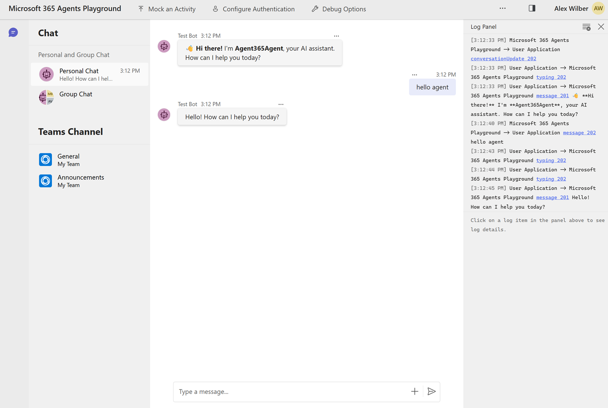
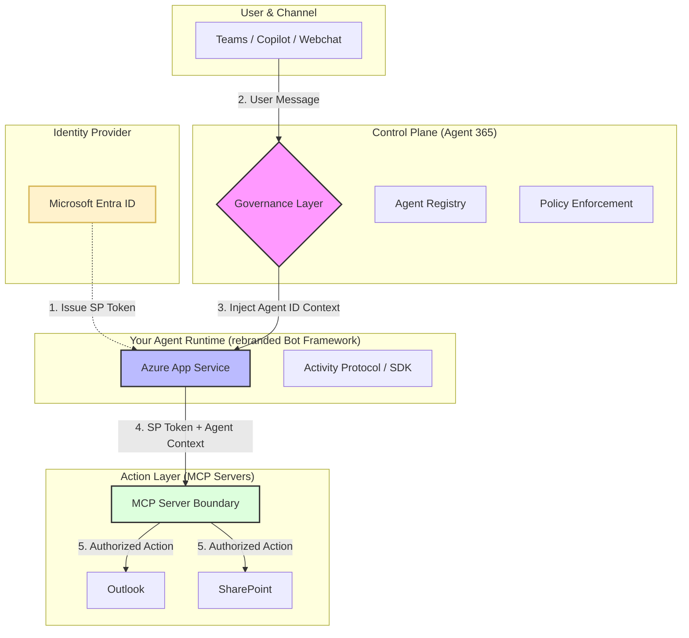

# Agent Monitoring with Agent365

Refactored <u>[Agent 365 with Microsoft Agent Framework sample](](https://github.com/microsoft/Agent365-Samples))</u>.

> [!NOTE]  
> The application was unable to complete setup or perform tool calling through MCP due to a permissions issue.  
> Agent 365 is currently in **preview/early access, not GA, as of Dec 2025**.

## Features

- **Observability**: Built-in tracing and monitoring via Agent365 SDK
- **MCP Tools**: Optional Model Context Protocol tool integration
- **Authentication**: Bearer token and client credentials support - Handlers work with OR without authentication. 
    1. Anonymous mode: No authentication required for local testing; OpenAI credentials are still needed and it can run without an MCP Tool Server. 
    2. Production mode: Full authentication when credentials provided.

## Screenshot



## Quick Start

[Set up and run the Python Agent framework sample agent](https://learn.microsoft.com/en-us/microsoft-agent-365/developer/quickstart-python-agent-framework)

1. Install dependencies: `pip install -e .`
2. Copy `.env.template` to `.env` and configure Azure OpenAI and your configurations.
3. Run: `python main.py`
4. Test: `curl -X GET http://localhost:3978/api/health`

## Prerequisite for Agent 365

1. Turn on Frontier features  
Microsoft Agent 365 - Eligibility: Customers must (1) have a Copilot License, (2) have Modern Billing, (3) Opt-in to Frontier
IT Admins: IT admins will need to ‘opt-in’ to the Frontier features in the Microsoft Admin Center  
    - Steps include MAC > Copilot > Settings > User Access > Copilot Frontier > Turn on Frontier features  
    - Customer must accept the Agent 365 Terms and Conditions (MAC > Agents > Agent Overview > Try)  
2. Install the Agent 365 CLI 
    ```powershell
    PS> dotnet tool install --global Microsoft.Agents.A365.DevTools.Cli
    ```
3. Global Administrator privileges - Run ONE-TIME setup script to create the Service Principal for Agent 365 Tools in your tenant.  
    - Download the [New-Agent365ToolsServicePrincipalProdPublic.ps1](https://github.com/microsoft/Agent365-devTools/blob/main/scripts/cli/Auth/New-Agent365ToolsServicePrincipalProdPublic.ps1) script  
    ```powershell
    PS> Set-ExecutionPolicy -Scope Process -ExecutionPolicy Bypass  
    PS> .\New-Agent365ToolsServicePrincipalProdPublic.ps1
    ```
4. Create your agentic identity and blueprint
    - [Agent blueprint and instance setup](https://learn.microsoft.com/en-us/microsoft-agent-365/developer/registration)
    - This step requires a service principal and administrator privileges to complete the configuration.

    ```powershell
    # 1. Initialize configuration
    PS> a365 config init
    PS> a365 config display # Verify configuration
    # 2. Create agent blueprint
    PS> a365 setup all # Create agent blueprint
    # PS> a365 setup all # Full setup (includes infrastructure)
    # PS> a365 setup all --skip-infrastructure # Skip infrastructure if it already exists
    PS> a365 config display -g # Verify configuration
    ```
5. M365 interacts with Application (w/ Agent) through public endpoint. The Application should be deployed in Azure Web Service.
6. Configure MCP authentication - [Accessing Agent 365 MCP Servers in Postman](https://www.linkedin.com/pulse/accessing-agent-365-mcp-servers-postman-david-feldman-jj8ve/): Predefined MCP Server list in Agent 365 | [Configure authentication](https://learn.microsoft.com/en-us/microsoft-agent-365/developer/testing). This step creates ToolingManifest.json.
    ```powershell
    a365 develop list-available
    a365 develop add-mcp-servers <serverName>
    a365 develop add-permissions <ServerName> <PermissionName>
    ``

7. Agents Playground - [Test your agent locally in Microsoft 365 Agents Playground](https://learn.microsoft.com/en-us/microsoft-365/agents-sdk/test-with-toolkit-project) 
    ```powershell
    PS> winget install agentsplayground
    # or
    PS> npm install -g @microsoft/m365agentsplayground
    ```

    Launch Agents Playground

    ```powerhsell
    PS> agentsplayground
    ```


## Agent 365 SDK

- [Microsoft Agent 365 SDK - Python](https://github.com/microsoft/Agent365-python)
- [Microsoft Agent 365 SDK Samples and Prompts](https://github.com/microsoft/Agent365-Samples)
- [pypi - microsoft-agents-a365](https://pypi.org/search/?q=microsoft-agents-a365)
- [Microsoft Agent 365 CLI](https://github.com/microsoft/Agent365-devTools)

### Agent 365: End-to-End Auth & Execution



<u>Microsoft 365 Agent (Agent 365) is tightly integrated with Microsoft 365 and is built on the Bot Framework lineage.</u>
When an agent is published, it deploys an **Azure App Service–based runtime** that exposes a **bot-style HTTPS endpoint**.

Authentication and authorization are split across **three** distinct layers:

* An **Azure AD service principal** represents the application and is used for startup, tenant-level authentication, OAuth token acquisition (MSAL), and access to Microsoft 365 resources — *service principal proves “this app is allowed”*.
* An **agent identity** represents the logical agent instance and is used by the Microsoft 365 Agent / Copilot control plane for governance, policy enforcement, scoping, routing, and lifecycle management, but is not used for OAuth or direct API calls — *agent identity proves “this agent is allowed to do this”*.
* **MCP servers enforce their own authorization boundary**, requiring both a valid service principal token (to verify app permissions) and the agent identity context (to verify per-agent tool access and policy) before executing actions against Microsoft 365 notifications or resources.

The platform supports multi-channel scenarios (Teams, Copilot Studio, Webchat, and selected third-party channels) and can interoperate with multiple agent frameworks.

While Bot Framework concepts (Activity protocol, TurnContext, adapters), with registration, governance, and lifecycle handled by the Microsoft 365 Agent / Copilot control plane rather than classic Bot Framework services.  

<u>Service principal proves “this app is allowed”; agent identity proves “this agent is allowed to do this” — MCP requires both.</u>

### Trobleshooting

Port coflicts

```powershell
# Windows PowerShell
Get-Process -Id (Get-NetTCPConnection -LocalPort <port>).OwningProcess | Stop-Process
```